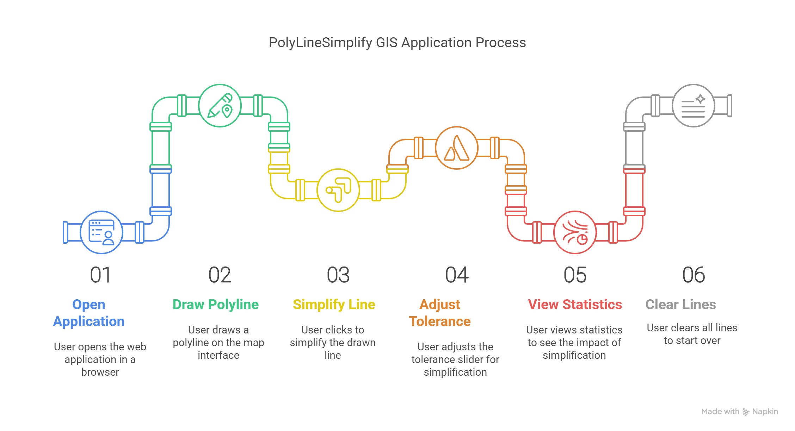

# PolyLineSimplify GIS - ENGO651 Lab 6

A web-based application for line simplification using Turf.js and Leaflet.

## Overview

PolyLineSimplify GIS allows users to draw polylines on a map and apply the Douglas-Peucker line simplification algorithm to reduce the number of points while maintaining the essential shape of the line. This tool demonstrates concepts of cartographic generalization through an interactive web interface.

## Live Demo

Try the application online: [PolyLineSimplify GIS Demo](https://amreshsharma01.github.io/PolyLineSimplify-GIS)

## Project Visual Walkthrough


## Features

- Interactive map interface for drawing polylines
- Real-time line simplification using Turf.js
- Adjustable tolerance level with a slider control
- Visual comparison between original and simplified lines
- Line statistics showing point count, length, and reduction percentage
- Responsive design using Bootstrap 5
- Clean, user-friendly interface with helpful instructions

## Technologies Used

- **Leaflet.js**: For map display and interaction
- **Leaflet.Draw**: For polyline drawing capabilities
- **Turf.js**: For geospatial analysis and line simplification
- **Bootstrap 5**: For responsive layout and UI components
- **HTML5/CSS3/JavaScript**: For structure, styling and functionality

## How to Use

1. Open the application in a web browser
2. Use the draw tools in the top right to draw a polyline on the map
3. Click the "Simplify Line" button to create a simplified version (shown in red)
4. Adjust the tolerance slider to control the level of simplification
5. View line statistics to see the impact of simplification
6. Use "Clear Lines" to remove all lines and start over

## Installation

No installation is required. Simply clone this repository and open the HTML file in a web browser.

```bash
git clone https://github.com/yourusername/engo651-lab6.git
cd engo651-lab6
# Open index.html in your browser
```

## Background

Line simplification is an important concept in cartography and GIS that helps reduce the complexity of linear features while maintaining their essential characteristics. This application implements the Douglas-Peucker algorithm (via Turf.js) which works by recursively dividing the line and eliminating points that deviate less than a specified tolerance from the simplified segments.

## Requirements

- Modern web browser with JavaScript enabled
- Internet connection (to load required libraries)

## License

This project is created for educational purposes as part of ENGO651 course assignment.